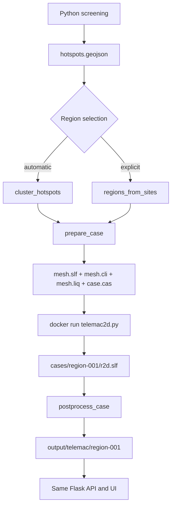
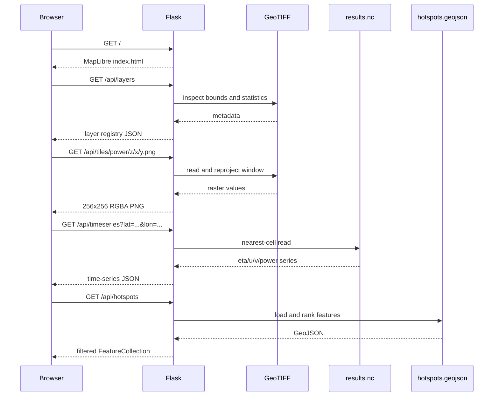

# Tidal-OSS Concepts, Architecture, and Outputs

This document is the integrated technical guide to the repository. It explains
what the project does, the scientific and software concepts behind it, how the
pieces fit together, what files and API responses are produced, and how to
extend or operate the system.

The repository is a two-phase tidal-current energy assessment workflow for the
Philippine archipelago:

1. A fast, coarse Python model screens a large geographic area for energetic
   tidal-current locations.
2. An optional TELEMAC-2D backend refines selected hotspots on an unstructured,
   higher-resolution mesh.
3. A Flask and MapLibre web application presents both the nationwide screening
   view and compatible regional refinement outputs.

The central architectural decision is that both hydrodynamic engines produce
the same canonical products. The web layer does not need to know whether a
GeoTIFF or NetCDF file came from the Python solver or TELEMAC post-processing.

## Contents

- [System Purpose](#system-purpose)
- [Conceptual Model](#conceptual-model)
- [Solution Architecture](#solution-architecture)
- [Repository Map](#repository-map)
- [Phase A: Python Screening](#phase-a-python-screening)
- [Phase B: TELEMAC Refinement](#phase-b-telemac-refinement)
- [Canonical Output Contract](#canonical-output-contract)
- [Web Application and API](#web-application-and-api)
- [Running the Workflow](#running-the-workflow)
- [General Code Patterns](#general-code-patterns)
- [Representative Outputs](#representative-outputs)
- [Testing and Quality Gates](#testing-and-quality-gates)
- [Limitations and Interpretation](#limitations-and-interpretation)
- [Related Documentation](#related-documentation)

## System Purpose

Tidal stream energy is driven by water velocity rather than water level alone.
The application estimates where moving seawater may provide a useful resource,
then exposes the estimate as an interactive marine spatial planning tool.

The primary screening metric is time-mean kinetic power density:

$$
P(t) = \frac{1}{2} \rho |\mathbf{U}(t)|^3,
\qquad
|\mathbf{U}| = \sqrt{u^2 + v^2}
$$

where:

- $P$ is power density in W/m²;
- $\rho$ is seawater density, 1025 kg/m³ by default;
- $u$ and $v$ are depth-averaged horizontal velocity components in m/s.

The value displayed as the main map layer is the average of $P(t)$ over the
saved simulation snapshots. Since power varies with the cube of speed, the
application also retains maximum current speed, bathymetry, and distance to
coast as separate layers for interpretation and feasibility screening.

This is a screening and decision-support system, not a final engineering or
consenting model. It is intended to answer questions such as:

- Which parts of the archipelago deserve closer investigation?
- What are the approximate current-speed and power-density distributions?
- How does a candidate polygon compare with the surrounding resource?
- Which representative turbine power curves are compatible with a site?
- Can a hotspot be refined locally without changing the web product format?

## Conceptual Model

### Tidal forcing

The model represents the tide as a sum of astronomical harmonic constituents.
The default set is M2, S2, K1, and O1. At each open-boundary point:

$$
\eta(t) = \sum_k A_k(\mathbf{x})
\cos\left(\omega_k t + \phi_k(\mathbf{x})\right)
$$

The forcing sources supported by `src/model/forcing.py` are:

| Source | Use | Input form |
|---|---|---|
| `synthetic` | Tests, demonstrations, and data-free runs | Generated harmonic boundary |
| `got` | Recommended real forcing when available | GOT4.10c constituent NetCDF files |
| `fes2014` | Alternative global harmonic model | Per-constituent FES NetCDF files |
| `tpxo9` | Alternative global harmonic model | TPXO9 atlas NetCDF file |

M2 and S2 have slightly different periods and create the approximately
14.77-day spring-neap modulation. This is why the default simulation duration
is 15 days: a shorter run may sample an unrepresentative part of the tidal
envelope.

### Shallow-water physics

The Python engine solves the depth-averaged shallow-water equations. In
conceptual form, continuity is:

$$
\frac{\partial \eta}{\partial t} +
\frac{\partial (hu)}{\partial x} +
\frac{\partial (hv)}{\partial y} = 0
$$

and momentum includes the principal terms:

$$
\frac{\partial u}{\partial t} =
-g\frac{\partial \eta}{\partial x}
+ fv
- \frac{C_d |\mathbf{u}|u}{h}
+ \text{optional advection and mixing}
$$

The corresponding equation for $v$ contains the y-directed pressure gradient
and the opposite Coriolis term. The main physical mechanisms are:

- **Pressure gradient:** converts a spatial difference in free-surface height
  into acceleration.
- **Continuity:** updates surface elevation when flux converges or diverges.
- **Bottom friction:** removes energy, especially in shallow water.
- **Coriolis:** deflects flow because the model covers a geographic domain.
- **Advection:** optionally represents nonlinear transport of momentum.
- **Horizontal mixing:** optionally stabilizes or smooths unresolved motion.

The cubic power law makes velocity accuracy especially important. A 10%
velocity error can produce a substantially larger power-density error, so power
maps should be read as model estimates rather than precise measurements.

### Arakawa C-grid arrangement

The screening model uses a staggered structured grid. Scalar quantities are
stored at cell centers, while velocity components are stored on cell faces:

```text
                 v[j+1, i]
                    ^
       u[j, i]  eta[j, i]  u[j, i+1]
                    v
                 v[j, i]

eta: (ny,   nx)       cell-center free-surface elevation
u:   (ny,   nx + 1)   x velocity on vertical faces
v:   (ny + 1, nx)     y velocity on horizontal faces
```

This arrangement makes flux divergence natural: the continuity update uses the
velocity and water depth on the faces surrounding each cell. It also makes
wetting and drying masks explicit at cell centers and velocity points.

`StructuredGrid` stores bathymetry as positive-down depth. Land and cells
shallower than `min_depth` are excluded from the wet mask, and invalid raster
cells are later written as NaN so the web map renders them transparently.

## Solution Architecture

### End-to-end architecture

```mermaid
flowchart LR
    D[External datasets\nGEBCO, shoreline, GOT/FES/TPXO] --> C[Configuration\nconfig.yaml]
    C --> G[Grid and bathymetry\nStructuredGrid]
    D --> G
    G --> F[Tidal boundary\nTidalBoundary]
    D --> F
    F --> S[Python screening\nShallowWaterSolver]
    S --> O[Canonical outputs\nNetCDF, GeoTIFF, GeoJSON]
    O --> W[Flask API\nweb/app.py]
    W --> UI[MapLibre frontend\nstatic/index.html]
    O --> H[Hotspot clustering]
    H --> M[TELEMAC case builder\nmesh, CLI, LIQ, CAS]
    M --> T[TELEMAC-2D\npublic Docker image]
    T --> R[Selafin result\nr2d.slf]
    R --> P[Post-processing\ncanonical regional outputs]
    P --> W
```



### Runtime boundaries

The repository has three practical runtime boundaries:

1. **Data and model boundary:** external NetCDF and GIS data become an in-memory
   grid and forcing object.
2. **Engine/output boundary:** either solver writes the same named products,
   allowing downstream consumers to remain engine-agnostic.
3. **File/API boundary:** Flask reads files from an output directory and turns
   rasters, time series, and GeoJSON into browser-friendly responses.

### Engine selection

The default is the Python engine:

```yaml
engine:
  name: python
```

The alternative is selected with:

```yaml
engine:
  name: telemac2d
```

`model.run.run_model()` dispatches to `run()` for Python or
`run_telemac_pipeline()` for TELEMAC. TELEMAC is not compiled in this
repository. The adapter prepares files and invokes a public image, configured
under `telemac2d.image`.

## Repository Map

```text
.
├── README.md                         Quick start and API summary
├── pyproject.toml                    Packaging, pytest, Ruff, and mypy config
├── docker-compose.yml                Web service container and output mount
├── downloader.py                     External dataset helper
├── cases/                            Prepared TELEMAC cases and meshes
├── output/                           Generated screening/refinement products
├── docs/
│   ├── README.md                       Documentation index
│   ├── AGENTS.md                       Canonical agent/contributor context
│   ├── plan.md                         Implementation plan and milestones
│   ├── concepts/
│   │   └── MODEL.md                    Detailed physics and methodology
│   ├── architecture/
│   │   ├── ARCHITECTURE.md             This integrated guide
│   │   ├── WORKFLOW.md                 Screening-to-TELEMAC workflow
│   │   └── workflow.drawio             Visual pipeline diagram
│   ├── engines/
│   │   ├── TELEMAC.md                  TELEMAC operation and caveats
│   │   ├── CASE_AUTHORING.md           Mesh and boundary conventions
│   │   ├── POSTPROCESSING.md           Selafin-to-product mapping
│   │   └── RECONCILIATION.md           Parent/refinement consistency
│   ├── operations/
│   │   ├── TROUBLESHOOTING.md          Operational failure modes
│   │   └── SCREENSHOTS.md              Executed end-to-end walkthrough
│   └── notebooks/
│       ├── EXPLAINER.ipynb             Runnable workshop notebook
│       └── workshop.ipynb              Generated slide-deck notebook
└── src/
    ├── model/
    │   ├── config.py                 Configuration loading and validation
    │   ├── config.yaml               Default simulation configuration
    │   ├── grid.py                   StructuredGrid and masks
    │   ├── bathymetry.py             GEBCO loading and regridding
    │   ├── forcing.py                Harmonic boundary forcing
    │   ├── solver.py                 C-grid shallow-water solver
    │   ├── kernels.py                Optional Numba step kernel
    │   ├── output.py                 NetCDF, GeoTIFF, and GeoJSON writers
    │   ├── run.py                    Screening and engine dispatch CLI
    │   ├── utils.py                  CFL, interpolation, and physical helpers
    │   ├── telemac/                  TELEMAC adapter and post-processor
    │   └── tests/                    Model and integration tests
    └── web/
        ├── app.py                    Flask API and raster service
        ├── turbines.py               Turbine data and performance model
        └── static/index.html         MapLibre user interface
```

## Phase A: Python Screening

### Input preparation

The screening pipeline first resolves a domain and constructs the grid:

```text
GEBCO NetCDF ──> load_gebco ──> regrid_bathymetry ──> elevation_to_depth ─┐
                                                                          ├─> StructuredGrid
land polygons ─> build_land_mask ─────────────────────────────────────────┘
```

If a bathymetry path is configured but missing, `model.run` logs a warning and
falls back to a synthetic rectangular test grid. This behavior is useful for
tests and demonstrations, but a production study should verify that the
intended bathymetry was actually loaded.

The grid builder computes:

- cell-center longitude and latitude arrays;
- approximate metric spacing `dx` and `dy` in meters;
- positive-down depth `h`;
- wet/dry cell mask;
- interpolated face depths and face masks;
- Coriolis parameter `f`;
- open-boundary cell mask.

### Time integration

`ShallowWaterSolver.step(dt)` follows this sequence:

1. Apply prescribed elevation at open-boundary cells.
2. Compute x-momentum tendency from pressure gradient, Coriolis, drag, and
   optional terms.
3. Apply semi-implicit bottom-friction correction to x velocity.
4. Compute and update y momentum using the corresponding terms.
5. Compute x and y volume flux differences.
6. Update interior free-surface elevation through continuity.
7. Reapply dry-cell masks and advance the simulation clock.

When the plain physics path is active, the solver may use the fused Numba
kernel. Enabling advection or horizontal mixing selects the NumPy path because
those terms are not handled by the simple fused kernel.

The time step can be explicitly configured or estimated using a CFL condition:

```python
from model.utils import cfl_timestep

dt = cfl_timestep(
    grid.dx,
    grid.dy,
    grid.h_max,
    safety=config["simulation"].get("cfl_safety", 0.5),
)
```

### Streaming and resume behavior

The model does not retain every full field in memory. At each configured save
interval, the callback writes a snapshot to an unlimited `time` dimension in
`results.nc`. The writer stores `eta`, staggered `u` and `v`, and
`power_density`.

The `--resume` option reads the last NetCDF state, restores the solver clock,
appends new snapshots, and recomputes the mean and maximum over the complete
file. This is important: the resumed output is not averaged over only the new
segment.

### Screening post-processing

After the run, `model.run.run()` writes:

1. Mean power density from the saved `power_density` snapshots.
2. Maximum cell-center current speed from the saved staggered velocity fields.
3. Bathymetry and distance-to-coast layers.
4. Hotspot points at or above `output.hotspot_threshold`.
5. Logging statistics including mean, maximum, P95, and hotspot count.

The distance-to-coast raster is a geographic feasibility aid. It is not a
cabling design calculation and does not account for bathymetric routing,
protected areas, seabed conditions, or transmission infrastructure.

## Phase B: TELEMAC Refinement

### Why a second engine exists

The 2 km structured screening grid is efficient for a national-scale pass but
cannot resolve every narrow strait. TELEMAC-2D provides a local unstructured
triangular finite-element simulation for selected regions. It is a refinement
stage, not a replacement for screening.



### Case preparation

The adapter creates a self-contained region directory:

```text
cases/region-001/
├── mesh.slf
├── mesh.cli
├── mesh.liq
├── case.cas
├── mesh_manifest.json
└── manifest.json
```

Generated meshes are refined from the region rather than simply reusing the
coarse screening triangles. Coordinates are represented in local tangent-plane
meters for TELEMAC physics, while `mesh_manifest.json` retains the longitude
and latitude mapping required to produce geographic outputs.

The boundary files have distinct responsibilities:

- `.slf` stores mesh geometry, connectivity, boundary numbering, and bed
  elevation in TELEMAC's positive-up convention.
- `.cli` classifies boundary points as liquid or solid and associates liquid
  points with prescribed-boundary columns.
- `.liq` contains time and boundary elevation values.
- `.cas` contains the TELEMAC steering parameters.
- `manifest.json` records provenance such as image, source settings, region,
  and generation choices.

### One-way nesting and reconciliation

By default, the refinement is a child of the screening run:

```text
screening results.nc ──> sample parent eta at liquid nodes ──> mesh.liq
```

This keeps the time window, epoch, datum, and spatial phase consistent. The
experimental Thompson velocity treatment is separately configurable and should
not be considered the default accepted path.

The post-processor writes `reconciliation.json` for comparable parent and
refined regions. It records statistics such as maximum power, maximum speed,
P95 speed, median speed, and ratios. Since power is cubic in speed, comparison
should use equivalent footprints and time windows rather than comparing only
global maxima.

### TELEMAC execution modes

The supported CLI stages are:

```bash
python -m model.telemac prepare --cases-dir cases
python -m model.telemac run --case cases/region-001
python -m model.telemac postprocess \
  --case-dir cases/region-001 \
  --output-dir output/telemac/region-001
```

The combined pipeline is:

```bash
python -m model.telemac pipeline --cases-dir cases
```

For details about boundary numbering, liquid columns, supplied meshes, and
known standing-wave failure modes, see `CASE_AUTHORING.md` and `TELEMAC.md` in
the [`engines/`](../engines/) section.

## Canonical Output Contract

The output contract is the interface between modeling and visualization. A
fresh screening run writes to `output/`; a refinement writes the same filenames
under `output/telemac/<region>/`.

| File | Format | Meaning | Units |
|---|---|---|---|
| `results.nc` | NetCDF4 | Saved elevation, velocity, and power time series | mixed |
| `tidal_power_density.tif` | Cloud-Optimized GeoTIFF | Time-mean power-density raster | W/m² |
| `max_current_speed.tif` | Cloud-Optimized GeoTIFF | Maximum depth-averaged speed | m/s |
| `bathymetry.tif` | Cloud-Optimized GeoTIFF | Wet-cell depth, positive down | m |
| `distance_to_coast.tif` | Cloud-Optimized GeoTIFF | Distance to nearest land cell | km |
| `hotspots.geojson` | GeoJSON | Point features above threshold | W/m² and m |
| `reconciliation.json` | JSON | Parent/refinement comparison | ratios and statistics |

### NetCDF structure

`results.nc` contains these dimensions:

```text
time: unlimited
y:    ny
x:    nx
x_u:  nx + 1
y_v:  ny + 1
```

The key variables are:

```text
eta             (time, y,   x)    m
u               (time, y,   x_u)  m/s
v               (time, y_v, x)    m/s
power_density   (time, y,   x)    W/m^2
lat             (y, x)            degrees_north
lon             (y, x)            degrees_east
```

Global attributes include `rho`, `cd`, forcing source, constituents, duration,
resolution, and domain. Refinement files also identify the TELEMAC source and
region in their metadata.

A general reader pattern is:

```python
from netCDF4 import Dataset
import numpy as np

with Dataset("output/results.nc") as ds:
    times_s = np.asarray(ds["time"][:])
    eta = np.asarray(ds["eta"][:])
    u_faces = np.asarray(ds["u"][:])
    v_faces = np.asarray(ds["v"][:])
    power = np.asarray(ds["power_density"][:])

u_center = 0.5 * (u_faces[:, :, :-1] + u_faces[:, :, 1:])
v_center = 0.5 * (v_faces[:, :-1, :] + v_faces[:, 1:, :])
speed = np.sqrt(u_center**2 + v_center**2)
```

### GeoTIFF conventions

The raster writers use:

- CRS `EPSG:4326`;
- a north-up transform;
- float32 data;
- LZW compression;
- NaN nodata values by default;
- row reversal when converting the model's south-to-north arrays into raster
  row order.

This means a GIS client can open the products directly, while the web server
can reproject them into EPSG:3857 for browser tiles.

### Hotspot GeoJSON

The hotspot writer emits a GeoJSON `FeatureCollection`. Each feature is a
point at a cell center:

```json
{
  "type": "Feature",
  "geometry": {
    "type": "Point",
    "coordinates": [120.5, 10.25]
  },
  "properties": {
    "power_density_Wm2": 412.7,
    "depth_m": 68.0
  }
}
```

Only wet cells at or above the configured threshold are exported.

## Web Application and API

### Web architecture



`src/web/app.py` is deliberately file-oriented. It does not run the
hydrodynamic solver during a request. This separates long-running scientific
work from lightweight map and query operations.

### Dataset selection

The default dataset is the screening output root. Regional refinement data is
selected with the `region` query parameter when that directory exists:

```text
screening: output/<canonical file>
refinement: output/telemac/<region>/<canonical file>
```

`GET /api/datasets` lists the available parent and regional datasets. This
supports a UI that can switch from an archipelago-wide view to a local refined
view without changing the API shape.

### Endpoint reference

| Endpoint | Method | Purpose |
|---|---:|---|
| `/` | GET | Serve the MapLibre frontend |
| `/api/layers` | GET | List layer metadata, bounds, stats, legends, availability |
| `/api/metadata` | GET | Backward-compatible power-layer metadata |
| `/api/datasets` | GET | List screening and available TELEMAC datasets |
| `/api/tiles/{z}/{x}/{y}.png` | GET | Power tile alias |
| `/api/tiles/{layer}/{z}/{x}/{y}.png` | GET | Layer tile for `power`, `speed`, `depth`, or `distance` |
| `/api/query?lat=&lon=&layer=` | GET | Nearest raster value |
| `/api/timeseries?lat=&lon=` | GET | Nearest-cell tidal series |
| `/api/turbines` | GET | Turbine specifications and power curves |
| `/api/turbine_performance?lat=&lon=` | GET | Simulate all listed turbines at a site |
| `/api/hotspots?min=&limit=` | GET | Filter and rank hotspot GeoJSON features |
| `/api/area_stats` | POST | Aggregate resource inside a polygon |
| `/api/resource` | GET | Aggregate filtered-domain resource totals |
| `/api/download/{file}` | GET | Download an approved canonical output |

Most dataset-aware endpoints accept `?region=region-001` to query a refined
dataset.

### Raster tiles

Tile requests are rendered on demand:

1. Convert XYZ tile coordinates to geographic and Web Mercator bounds.
2. Reproject the source GeoTIFF into a 256 x 256 EPSG:3857 tile.
3. Apply the layer's configured piecewise-linear RGBA color map.
4. Make NaN and nodata values transparent.
5. Cache the PNG using the source file modification time as part of the key.

The maximum supported zoom is `10`. Requests outside valid XYZ coordinates are
rejected or return an empty response.

### Resource aggregation

For a selected set of valid cells, the API reports:

- cell count and approximate area;
- mean, maximum, and P95 power density;
- gross MW;
- extractable MW after an efficiency factor;
- annual energy estimate in GWh/year.

The default extraction efficiency is 0.4. It is a planning assumption, not a
claim about a specific turbine array. The calculation is conceptually:

```python
extractable_mw = gross_w * efficiency / 1e6
```

### Turbine performance

`src/web/turbines.py` contains a curated ten-turbine dataset. The power model
uses cut-in, rated, and cut-out speeds:

```text
speed < cut-in       -> 0
cut-in to rated      -> cubic ramp to rated power
rated to cut-out     -> rated power
speed >= cut-out     -> 0
```

The API integrates the resulting power series with the trapezoidal rule and
returns energy over the sampled window, mean output, capacity factor, annual
energy, and the full power series.

## Running the Workflow

### Environment and installation

The package uses Python 3.10 or newer. A local development install can be
created with:

```bash
python -m venv .venv
source .venv/bin/activate
pip install -e .
pip install -r src/requirements-dev.txt
```

The repository also provides locked requirement files under `src/` and Docker
images for repeatable execution. External datasets are intentionally not
bundled because of size and licensing constraints.

### Data-free demonstration

When no valid bathymetry path is present, the model can use its synthetic test
grid. This is suitable for checking code paths and producing demonstration
outputs, not for resource claims.

```bash
python -m model.run --tidal-source synthetic --output-dir output/demo
```

Depending on the installation method, use `PYTHONPATH=src` or an editable
install so that the `model` package is importable.

### Real screening run

The normal sequence is:

```bash
python downloader.py --all
# Place GEBCO in the configured location manually when required.
python -m model.run --config src/model/config.yaml
```

Useful overrides include:

```bash
python -m model.run \
  --duration-days 15 \
  --resolution-km 2.0 \
  --output-dir output
```

### Start the web service

With Docker Compose:

```bash
```

The compose service maps host port `8001` to container port `5000` and mounts
`./output` at `/output`. Open `http://localhost:8001` after outputs exist.

For local execution:

```bash
OUTPUT_DIR=output PYTHONPATH=src \
  python -m web.app --host 0.0.0.0 --port 5000
```

### Refine hotspots

Run the complete engine pipeline after screening:

```bash
python -m model.run --engine telemac2d
```

Or operate the stages individually:

```bash
python -m model.telemac prepare --cases-dir cases
python -m model.telemac run --case cases/region-001
python -m model.telemac postprocess \
  --case-dir cases/region-001 \
  --output-dir output/telemac/region-001
```

The TELEMAC Docker image should be pinned by tag or digest for a reproducible
study. On Apple Silicon, check the image architecture and use an appropriate
`linux/amd64` platform when required.

## General Code Patterns

### Build a small idealized simulation

The following pattern mirrors the public model objects without depending on
the command-line orchestration:

```python
import numpy as np

from model.forcing import make_synthetic_tidal_boundary
from model.grid import StructuredGrid
from model.solver import ShallowWaterSolver

grid = StructuredGrid.from_uniform(
    nx=80,
    ny=30,
    dx=2_000.0,
    dy=2_000.0,
    lat0=12.5,
)
grid.h[:] = 50.0
grid.h_u[:] = 50.0
grid.h_v[:] = 50.0
grid.open_boundary[:, 0] = True
grid.open_boundary[:, -1] = True

boundary = make_synthetic_tidal_boundary(
    int(grid.open_boundary.sum()),
    amplitude=0.5,
    constituents=["M2", "S2"],
)

solver = ShallowWaterSolver(grid, cd=0.0025)
solver.set_open_boundary_eta(boundary)
solver.set_initial_conditions()
solver.run(dt=10.0, duration=6 * 3600.0)

instantaneous_power = solver.compute_power_density()
print(float(np.nanmax(instantaneous_power)))
```

For geographic output, prefer `StructuredGrid.from_bathymetry()` because it
has degree-based longitude and latitude arrays suitable for GeoTIFF bounds.

### Read layer metadata and query a point

```bash
curl http://localhost:5000/api/layers | jq
curl "http://localhost:5000/api/query?lat=10.25&lon=120.5&layer=power" | jq
curl "http://localhost:5000/api/query?lat=10.25&lon=120.5&layer=speed" | jq
```

A point response has this general form:

```json
{
  "lat": 10.25,
  "lon": 120.5,
  "layer": "power",
  "value": 412.7
}
```

### Request a time series

```bash
curl "http://localhost:5000/api/timeseries?lat=10.25&lon=120.5" | jq
```

The response includes the snapped cell coordinate, time in hours, elevation,
speed, power, and summary statistics:

```json
{
  "lat": 10.25,
  "lon": 120.5,
  "time_hours": [0.0, 1.0, 2.0],
  "eta_m": [0.12, 0.31, 0.08],
  "speed_mps": [0.18, 0.64, 0.27],
  "power_wm2": [3.0, 134.4, 10.1],
  "summary": {
    "max_speed_mps": 0.64,
    "mean_speed_mps": 0.36,
    "max_eta_m": 0.31,
    "mean_power_wm2": 49.2,
    "n_points": 3
  }
}
```

The values above are illustrative response shapes, not guaranteed values from
the repository's current output directory.

### Compute polygon statistics

```bash
curl -X POST http://localhost:5000/api/area_stats \
  -H 'Content-Type: application/json' \
  -d '{
    "polygon": [[120.2, 10.1], [120.8, 10.1], [120.8, 10.6], [120.2, 10.6]],
    "efficiency": 0.4
  }' | jq
```

The polygon uses `[longitude, latitude]` points. The server closes the ring,
selects raster cells whose centers are inside it, and reports resource totals.

### Filter resource totals

```bash
curl "http://localhost:5000/api/resource?min_power=200&depth_min=20&depth_max=150&efficiency=0.4" | jq
```

### Add a new layer

To add a layer consistently:

1. Produce a cell-center GeoTIFF with the existing writer and EPSG:4326.
2. Add its filename, label, units, range, and colormap to `LAYERS` in
   `src/web/app.py`.
3. Ensure the file is included in the download allow-list through `LAYERS`.
4. Add the corresponding frontend toggle in `src/web/static/index.html`.
5. Add or update tests for metadata, query, and tile availability.

Avoid adding special-case engine logic to the web layer. If a new engine can
write the canonical filenames, it should be automatically consumable.

## Representative Outputs

### Command-line completion

A successful screening run logs progress and summary information similar to:

```text
Starting simulation: <steps> steps x <dt> s = 15.0 days
t=1.0 d (  6.7%) | wall=<seconds> s | max|eta|=<value> m | max|U|=<value> m/s
Simulation complete: 15.0 d simulated in <seconds> s wall time
Mass check: initial volume = <value>, final = <value>, drift = <value> %
Wrote NetCDF: output/results.nc (<snapshots> snapshots)
Wrote GeoTIFF: output/tidal_power_density.tif
Wrote GeoTIFF: output/max_current_speed.tif
Wrote GeoTIFF: output/bathymetry.tif
Wrote GeoTIFF: output/distance_to_coast.tif
Wrote hotspots GeoJSON: output/hotspots.geojson
Power density stats [W/m²]:
  mean  = <value>
  max   = <value>
  P95   = <value>
  hotspots (> 200 W/m²) = <count> cells
```

The angle-bracket values depend on input data, resolution, forcing, and
simulation settings. They should not be hard-coded into documentation or
used as acceptance criteria without a specified dataset.

### Typical output tree

```text
output/
├── results.nc
├── tidal_power_density.tif
├── max_current_speed.tif
├── bathymetry.tif
├── distance_to_coast.tif
├── hotspots.geojson
└── telemac/
    └── region-001/
        ├── results.nc
        ├── tidal_power_density.tif
        ├── max_current_speed.tif
        ├── bathymetry.tif
        ├── distance_to_coast.tif
        ├── hotspots.geojson
        └── reconciliation.json
```

Some files may be absent until the relevant stage has completed. The web API
reports unavailable layers rather than inventing values.

### Example resource response

```json
{
  "n_cells": 128,
  "area_km2": 512.4,
  "mean_power_density": 287.5,
  "max_power_density": 1042.1,
  "p95_power_density": 618.2,
  "gross_mw": 147.3,
  "extractable_mw": 58.9,
  "aep_gwh_yr": 516.0
}
```

These values are illustrative. Gross MW is the integral of modeled power
density over selected raster cells; extractable MW applies the requested
efficiency factor; annual energy assumes 8760 hours and does not model outages,
availability, wake losses, electrical losses, or curtailment.

## Testing and Quality Gates

Run the complete test suite from the repository root:

```bash
python -m pytest
```

The tests cover conservation, channel flow, standing-wave behavior,
bathymetry and forcing pipelines, output round trips, CFL behavior, restart
consistency, configuration, and web/API behavior where available.

Run the static quality checks used by CI:

```bash
ruff check src downloader.py scripts/generate_test_data.py
ruff format --check src downloader.py scripts/generate_test_data.py
mypy src/model src/web
```

When changing the solver, grid, forcing, kernels, or output code, prioritize:

- mass conservation and nonnegative power checks;
- tests with synthetic forcing before real datasets;
- NetCDF and GeoTIFF round trips;
- a complete run with the same configuration used by downstream web tests;
- validation that no unintended files or generated artifacts are added.

## Limitations and Interpretation

The project is intentionally a screening cascade:

```text
coarse Python model
        |
        v
candidate hotspots
        |
        v
high-resolution TELEMAC-2D
        |
        v
turbine-array and environmental studies
        |
        v
pilot deployment
```

Important limitations include:

- velocity is depth-averaged rather than resolved at turbine hub height;
- stratification, wave-current interaction, sediment transport, and morphology
  are not represented in the screening model;
- turbine wakes, blockage, array interactions, and feedback on the flow are
  not represented by the raster resource calculation;
- coarse grids can smear or miss narrow channels;
- synthetic forcing and fallback bathymetry are for testing, not development
  decisions;
- distance to coast is a geometric raster metric, not an infrastructure route;
- turbine data and performance curves are representative planning data, not
  procurement specifications;
- annual energy values are simple extrapolations from modeled snapshots;
- TELEMAC results require careful boundary orientation, forcing, friction,
  bathymetry, and reconciliation checks.

The most important interpretation rule is to compare like with like: use the
same geographic footprint, wet-area mask, time window, output cadence, power
formula, and statistic when comparing screening and refinement. A refined
maximum should not automatically be expected to equal a coarse-grid maximum.

## Related Documentation

Use this document as the architectural index and the following pages for depth:

- `MODEL.md` ([concepts/](../concepts/MODEL.md)): physics, equations, resource
  interpretation, and references.
- `WORKFLOW.md` ([architecture/](WORKFLOW.md)): detailed screening-to-TELEMAC stages.
- `TELEMAC.md` ([engines/](../engines/TELEMAC.md)): Docker execution, configuration,
  and standing-wave caveats.
- `CASE_AUTHORING.md` ([engines/](../engines/CASE_AUTHORING.md)): mesh, `.cli`,
  `.liq`, and `.cas` conventions.
- `POSTPROCESSING.md` ([engines/](../engines/POSTPROCESSING.md)): Selafin fields and
  canonical output mapping.
- `RECONCILIATION.md` ([engines/](../engines/RECONCILIATION.md)): parent-child nesting
  and acceptance metrics.
- `TROUBLESHOOTING.md` ([operations/](../operations/TROUBLESHOOTING.md)): operational
  symptoms and fixes.
- `../../README.md`: shortest quick-start path and endpoint list.
- `../../src/README.md`: dataset acquisition and step-by-step setup.
